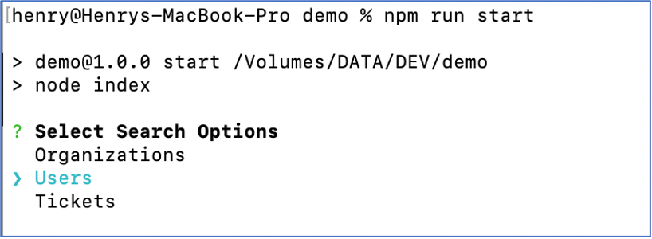
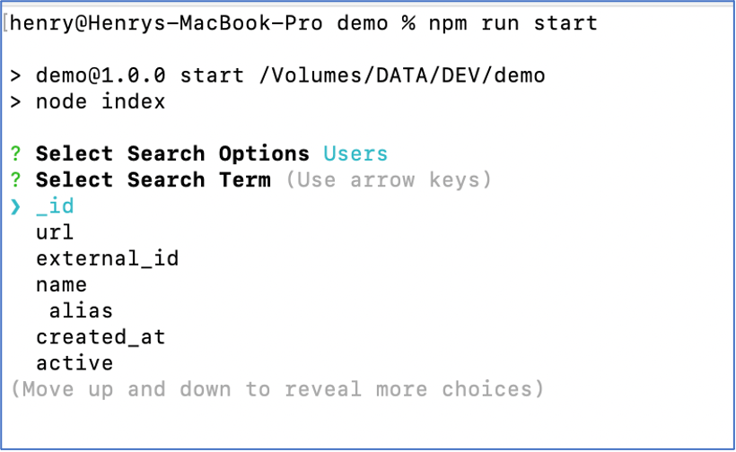
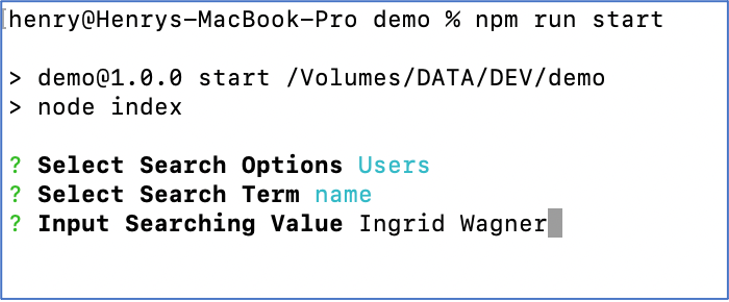
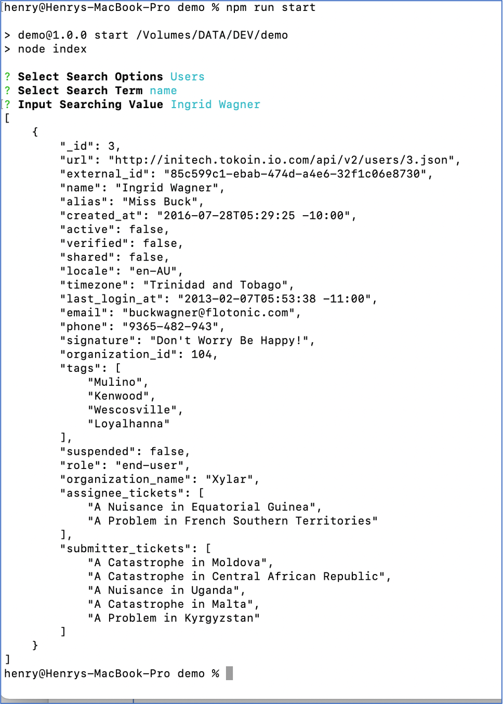

# Interview practice of NEC

Please make sure the NodeJS has been ready in your environment.

### Install:  run cmd
```
npm i
```


### Start: run cmd
```
npm run start
```

### Sample Case

####Step1: 'Select Search Options'



####Step2: 'Select Search Term'



####Step3: 'Input Searching Value'




####Result


